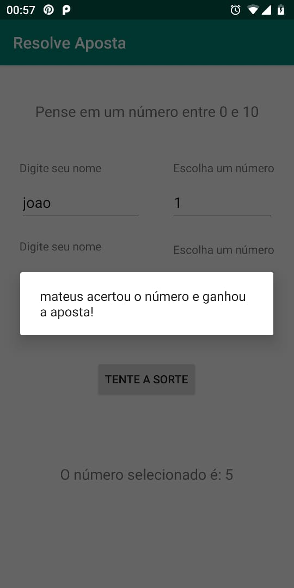

# Resolve_Aposta-JAVA

Esse é um aplicativo desenvolvido em JAVA para android.

Esse app pode ser utilizado para decidir uma aposta entre duas pessoas, cada um chuta um número entre 0 e 10, o app vai sortear um número,
e quem acertar esse número ganha.

